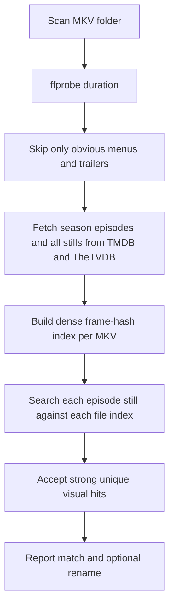

# MKV Episode Matcher

Identify MakeMKV rips of a **known series and season** by finding TMDB and
TheTVDB episode screencaps **inside the video itself**.

This automates the slow manual loop: open each rip, hunt for a distinctive
shot, compare it against provider stills, rename the file. Instead of you
scrubbing an episode looking for the frame, the tool hashes the whole episode
once and searches every published still against it.

```
$ mkv-episode-matcher match ./rips --series "Test Precinct" --season 2

                                          MKV episode matches
┏━━━━━━━━━━━━━━━┳━━━━━━━━━┳━━━━━━━━━┳━━━━━━━━━━━━━━━━━━━━━━━━━━━━━━┳━━━━━━┳━━━━━━━━┳━━━━━━━━━━┳━━━━━━━━━━━┳━━━━━━━━━━━━━━━━━━━━┓
┃ File          ┃ Status  ┃ Episode ┃ Title                        ┃ Dist ┃ Stills ┃ Found at ┃ Runner-up ┃ Notes              ┃
┡━━━━━━━━━━━━━━━╇━━━━━━━━━╇━━━━━━━━━╇━━━━━━━━━━━━━━━━━━━━━━━━━━━━━━╇━━━━━━╇━━━━━━━━╇━━━━━━━━━━╇━━━━━━━━━━━╇━━━━━━━━━━━━━━━━━━━━┩
│ title_t00.mkv │ matched │ S02E03  │ The Second Oldest Profession │    0 │      1 │ 00:14:22 │ S02E02    │                    │
│ title_t01.mkv │ matched │ S02E01  │ Chipped Beef                 │    0 │      5 │ 00:03:10 │ S02E03    │                    │
│ title_t02.mkv │ matched │ S02E04  │ Rites of Spring              │    0 │      2 │ 00:21:44 │ S02E03    │                    │
│ title_t03.mkv │ matched │ S02E02  │ Blood Money                  │    0 │      2 │ 00:08:56 │ S02E03    │                    │
│ title_t04.mkv │ skipped │ -       │ -                            │    - │      - │        - │ -         │ skipped: too_short │
└───────────────┴─────────┴─────────┴──────────────────────────────┴──────┴────────┴──────────┴───────────┴────────────────────┘
11 stills across 4 episodes
matched=4 ambiguous=0 unmatched=0 skipped=1 in 0.5s
```

Columns with nothing to report are dropped, so a clean run stays narrow.

Every match reports the still that identified it and the timestamp where that
still was found, so verifying the answer means jumping to one second of video
rather than watching the episode.

## What decides a match

The signal priority is deliberate, and comes from how these discs actually
behave:

1. **Screencap matching** is the only identity signal. An episode is claimed
   because one of its published frames was found inside a particular rip.
2. **Duration** is a skip-floor and nothing more. It throws away menus, logo
   stings, and trailers. It never ranks or identifies episodes, because
   broadcast discs routinely report rounded, copied, or identical runtimes for
   every episode of a season.
3. **Disc title order is never used.** Playlist order frequently disagrees with
   aired, TMDB, and TheTVDB numbering, so treating it as a prior would quietly
   produce confident wrong answers.

There is no duration-only or best-guess path to a rename. A file is renamed
only when visual evidence says so, clearly.

## Install

Requires Python 3.11+ and `ffmpeg`/`ffprobe` on `PATH`.

```bash
uv sync
uv run mkv-episode-matcher --help
```

Set credentials as environment variables (or pass `--tmdb-key` / `--tvdb-key`):

```bash
export TMDB_API_KEY=...      # v3 key or v4 bearer token, both work
export TVDB_API_KEY=...
export TVDB_PIN=...          # only if your TheTVDB account requires one
```

## Usage

```bash
# Dry run: report only, change nothing
mkv-episode-matcher match ./rips --series "Hill Street Blues" --season 2

# Save machine-readable output and side-by-side previews for spot-checking
mkv-episode-matcher match ./rips -s "Hill Street Blues" -n 2 \
    --json report.json --previews ./previews

# Rename the confident matches to a Plex-style layout
mkv-episode-matcher match ./rips -s "Hill Street Blues" -n 2 --rename
```

Renaming produces `Show - S02E01 - Title.mkv`, refuses to overwrite an existing
file without `--force`, and never touches an `ambiguous`, `unmatched`, or
`skipped` result.

### Tuning

| Option | Default | What it does |
|---|---|---|
| `--interval` | `1.0` | Seconds between sampled frames. Denser finds more, costs more decode time. |
| `--threshold` | `12` | Maximum pHash Hamming distance (of 64 bits) for a still to count as found. |
| `--gap` | `4.0` | How far the runner-up must lose by before a match is called confident. |
| `--workers` | `4` | Concurrent ffmpeg processes and downloads. |
| `--refine` | off | Two-stage mode: index coarsely, then re-sample densely around promising hits. |
| `--min-minutes` | `5` | Skip-floor for menus and trailers. |
| `--refresh` | off | Rebuild frame indexes even when cached. |
| `--strict` | off | Exit `2` if any file is still ambiguous or unmatched. |
| `-v`, `-vv` | off | Narrate the run; `-vv` logs every ffmpeg call and cache decision. |

Raising `--interval` to 4-5 seconds with `--refine` is the fastest useful
configuration on a long disc: the coarse pass locates roughly where a still
lives, and only a few seconds around each candidate get re-decoded densely.

## How it works



**One decode per file.** Frames are sampled through a single `ffmpeg` process
streaming raw grayscale over a pipe, normalised (letterbox/pillarbox cropped,
squashed to a canonical size), and hashed with pHash and dHash. Provider stills
go through the identical normalisation, which is what makes the distances
between a 1080p frame and a 780px JPEG comparable at all.

**Indexes persist.** A frame index is keyed by file size, mtime, and the
sampling parameters, so re-matching a disc costs a few milliseconds of Hamming
arithmetic instead of another full decode. API responses, downloaded stills,
and still hashes are cached too: a repeat run makes no network calls.

**Evidence is aggregated, then assigned globally.** Each episode's stills are
searched against each file's index; the best distance and the number of
agreeing stills become an assignment cost. Files and episodes are paired by a
Hungarian solver, with over-threshold pairs forbidden outright. A file is only
`matched` when it and its episode are each other's clear best choice by
`--gap`; contention or a near-tie is reported as `ambiguous` with the reasoning
attached, never force-fit.

**dHash is a veto, not a vote.** A hit whose difference hash disagrees badly
with its perceptual hash is treated as a probable collision: it stops counting
as support and is penalised out of contention.

### Timestamps are real

Sampling uses ffmpeg's `select` filter and reads true presentation times from
`showinfo`, rather than the more obvious `fps` filter. `fps` resamples onto a
synthetic clock and stamps each output frame with a time up to half an interval
*earlier* than the picture it actually carries — at a 3-second interval, a
frame reported at `3.0s` can show what is on screen at `4.0s`. Since the whole
point of the report is that you can jump straight to the matched moment, that
error would undermine it. There is a regression test asserting reported
timestamps match on-screen content across several intervals.

## Components

| Module | Responsibility |
|---|---|
| `probe.py` | ffprobe inventory and the duration skip-floor |
| `frames.py` | Dense ffmpeg sampling, normalisation, persistent hash index |
| `normalize.py` | The one crop/resize/hash pipeline shared by frames and stills |
| `tmdb_client.py` | Season episodes plus every still |
| `tvdb_client.py` | Season episodes plus screencap artwork |
| `metadata.py` | Pools episodes and stills across providers |
| `score_visual.py` | Still-to-index search, thresholds, multi-still agreement |
| `assign.py` | Global 1:1 assignment and the match/ambiguous rules |
| `pipeline.py` | Orchestration, independent of the CLI |
| `report.py` | Table, JSON, side-by-side previews |
| `rename.py` | Plex-style naming with the safety rails |

## Development

```bash
uv sync
uv run pytest                      # full suite
uv run pytest -m "not slow"        # skip the video-encoding integration tests
uv run ruff check . && uv run ruff format --check .
uv run ty check src
```

Tests avoid mocks where real code can run: provider tests replay recorded JSON
through `httpx.MockTransport` so request building, retries, and error handling
all execute for real, and the end-to-end tests encode actual videos with
ffmpeg and plant known frames in them.

The integration fixture is built to be hostile to shortcuts: four episodes of
**identical runtime** in **shuffled disc order**, one episode with five stills
and one with a single usable still, one episode reachable only through
TheTVDB, and a published still that appears nowhere in any rip. A correct
answer can only come from finding stills inside the video.

## Scope

v1 handles one episode per file. Not yet supported: double/multi-part
episodes, "Play All" concatenated titles, automatic series identification,
audio or subtitle fingerprinting, CLIP-style embedding fallback for heavily
graded promotional stills, and any GUI.
